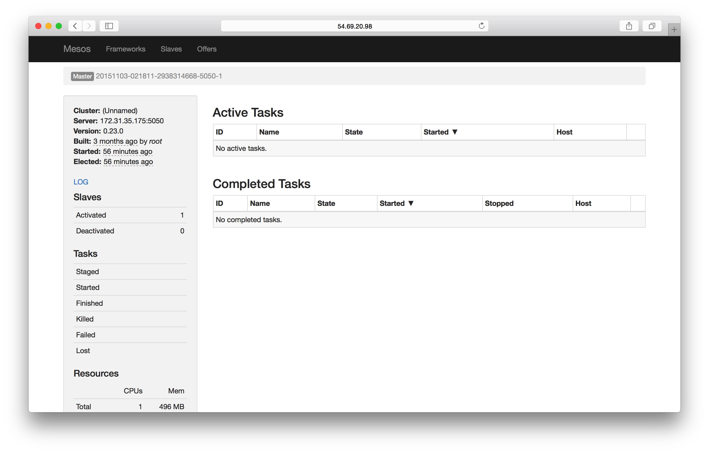

# 容器云搭建

本章我们将开始真正的环境搭建。

提前声明，在整个项目中，我们使用四台服务器。

    Node1 : 172.31.35.175
    Node2 : 172.31.23.17
    Node3 : 172.31.40.200
    Node4 : 172.31.55.55

#zookeeper 集群
前面章节我们搭建的zookeeper是单点的，这里我们需要搭建一个zookeeper集群，这里我们先搭建一个拥有三个节点的zookeeper集群。

首先在Node1上：

    docker run -d -e MYID=1 -e SERVERS=172.31.35.175,172.31.23.17,172.31.40.200 --name=zookeeper --net=host --restart=always mesoscloud/zookeeper:3.4.6-ubuntu-14.04
    
其中的参数，`MYID`为zookeeper集群中的唯一值，用来确定当前节点在集群中的ID。`SERVERS`为指定当前集群每个zookeeper节点所在服务器的IP。

然后在Node2上：

    docker run -d -e MYID=2 -e SERVERS=172.31.35.175,172.31.23.17,172.31.40.200 --name=zookeeper --net=host --restart=always mesoscloud/zookeeper:3.4.6-ubuntu-14.04
    
Node3:
    
    docker run -d -e MYID=3 -e SERVERS=172.31.35.175,172.31.23.17,172.31.40.200 --name=zookeeper --net=host --restart=always mesoscloud/zookeeper:3.4.6-ubuntu-14.04

启动完毕后，我们进入各个机器的容器查看zookeeper启动情况。

    root@ip-172-31-23-17:/opt/zookeeper/bin# ./zkServer.sh status
    JMX enabled by default
    Using config: /opt/zookeeper/bin/../conf/zoo.cfg
    Mode: leader
    
    root@ip-172-31-35-175:/opt/zookeeper/bin# ./zkServer.sh status
    JMX enabled by default
    Using config: /opt/zookeeper/bin/../conf/zoo.cfg
    Mode: follower
    
    root@ip-172-31-40-200:/opt/zookeeper/bin# ./zkServer.sh status
    JMX enabled by default
    Using config: /opt/zookeeper/bin/../conf/zoo.cfg
    Mode: follower

可以看到，`172.31.23.17`为leader，其他的为follower，这样zookeeper集群就搭建完毕了。

#Mesos 集群搭建
前面章节我们搭建的mesos集群都是单master节点，生产环境下一定是需要HA的。因此我们这里搭建一个三个master节点的mesos集群。

    docker run -d -e MESOS_HOSTNAME=172.31.35.175 -e MESOS_IP=172.31.35.175 -e MESOS_QUORUM=2 -e MESOS_ZK=zk://172.31.35.175:2181,172.31.23.17:2181,172.31.40.200:2181/mesos --name mesos-master --net host --restart always mesoscloud/mesos-master:0.23.0-ubuntu-14.04
    
这是在机器Node1上执行的命令。其中的参数没什么变化，只是zk那里加了三个zookeeper节点。同样的在Node2，和Node3上执行类似的命令。

    docker run -d -e MESOS_HOSTNAME=172.31.23.17 -e MESOS_IP=172.31.23.17 -e MESOS_QUORUM=2 -e MESOS_ZK=zk://172.31.35.175:2181,172.31.23.17:2181,172.31.40.200:2181/mesos --name mesos-master --net host --restart always mesoscloud/mesos-master:0.23.0-ubuntu-14.04
    
    docker run -d -e MESOS_HOSTNAME=172.31.40.200 -e MESOS_IP=172.31.40.200 -e MESOS_QUORUM=2 -e MESOS_ZK=zk://172.31.35.175:2181,172.31.23.17:2181,172.31.40.200:2181/mesos --name mesos-master --net host --restart always mesoscloud/mesos-master:0.23.0-ubuntu-14.04
    
这样我们尝试访问其中一个Node的页面。

可以看到当前访问的节点并不是master节点，说明在这三个节点的选举中，他没有被选举上。mesos会自动帮你跳转到当前master节点所在的服务器。

这样一个具有三个master节点的mesos集群就配置好了，如果其中一个master宕机，另外两个master就会选举出来一个新的master，保证当前集群不会因为没有master而宕掉。

我们在zookeeper的mesos znode上也可以看到选举的结果信息。

    [zk: 127.0.0.1:2181(CONNECTED) 5] get /mesos/info_0000000003
    !20151103-021835-3358072748-5050-1????
    '"master@172.31.40.200:5050*
    cZxid = 0x100000016
    ctime = Tue Nov 03 02:18:22 UTC 2015
    mZxid = 0x100000016
    mtime = Tue Nov 03 02:18:22 UTC 2015
    pZxid = 0x100000016
    cversion = 0
    dataVersion = 0
    aclVersion = 0
    ephemeralOwner = 0x350cb21c20f0004
    dataLength = 94
    numChildren = 0

我们向其中加入一个slave实验一下。

    docker run -d -e MESOS_HOSTNAME=172.31.35.175 -e MESOS_IP=172.31.35.175 -e MESOS_MASTER=zk://172.31.35.175:2181,172.31.23.17:2181,172.31.40.200:2181/mesos -v /sys/fs/cgroup:/sys/fs/cgroup -v /var/run/docker.sock:/var/run/docker.sock --name mesos-slave --net host --privileged --restart always mesoscloud/mesos-slave:0.23.0-ubuntu-14.04
    

可以看到，salve已经注册成功，这样我们就搭建了一个具有三个master节点的mesos集群。