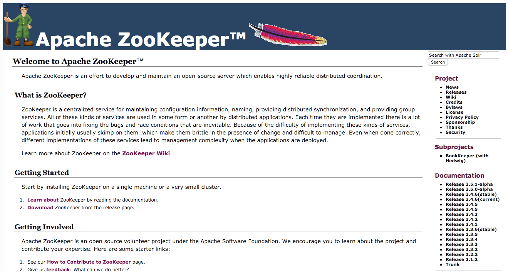

# 搭建一个 Mesos 集群

实践出真知，学习 Mesos 也不例外，这里将介绍怎样搭建一个最小生产集群。
由于 Mesos 对 Linux 支持最好，所以这里将介绍怎样在 Linux 环境下搭建 Mesos 集群；
另外，考虑到在生产环境中主要以 RHEL/CentOS 为主，所以本节内容都基于 CentOS 7。

## 准备工作

在开始搭建 Mesos 集群之前，需要准备以下环境。

  - 3 台 Intel x86/x86_64 架构的计算机
  - 计算机中安装了 CentOS 7.1 操作系统
  - 计算机至少配备了 1core, 1GB 内存

如果准备 3 台物理机有难度，虚拟机也是可以的，介绍怎样准备虚拟机，
怎样安装 CentOS 7.1 操作系统超出了本书的范围，不再赘述。

假设 3 台计算机分别为：

  - A, IP 192.168.1.101
  - B, IP 192.168.1.102
  - C, IP 192.168.1.103

下面我们将在这三台计算机中搭建一个 Mesos 集群。

在开始之前，我们选定 A 作为操作机，大部分的操作都将在 A 上完成，在 A 上通过 SSH
连接到 B 和 C 来完成部署。

### 设置 SSH 环境 FIXME: 后文貌似没怎么用上，可以删除

在 CentOS 7 上搭建 SSH 非常简单，只需要安装上 SSH 服务器和客户端即可，
并且系统的默认安装已经自带了 SSH 客户端。

由于这里使用 A 作为控制机，所以需要在 B 和 C 上安装 SSH
服务器端，并且配置好账号以便能够从 A 上登录。

下面的操作需要在 B 和 C 上完成，这里以 B 为例。

由于要执行一些特权操作，所以这里直接切换到 root 用户，所以，一定要小心操作，
以免损坏系统。

```
$ su - root
Password:
```

在输入 root 用户密码后，即获得了 root 用户权限。下面来安装 SSH 服务器，
输入如下命令。

```
# yum clean all
# yum makecache
# yum install -y openssh-server
```

安装完成后，设置 SSH 服务器开机启动，并且启动 SSH 服务器。

```
# systemctl enable sshd.service
# ssytemctl start sshd.service
```

`systemctl` 是 systemd 的控制命令，上面两条命令分别为设置 sshd.service
为开机启动和立即启动 sshd.service。

启动后，同样可以通过 `systemctl` 命令来查看 sshd.service 的状态。

```
# systemctl status sshd.service
sshd.service - OpenSSH server daemon
   Loaded: loaded (/usr/lib/systemd/system/sshd.service; enabled)
   Active: active (running) since Mon 2015-11-16 17:30:12 CST; 2 weeks 5 days ago
 Main PID: 986 (sshd)
   CGroup: /system.slice/sshd.service
           └─986 /usr/sbin/sshd -D
...
```

开启了 SSH 服务器后，该机器上的用户就可以从其它任何可以访问该机器 SSH
服务的地方登陆系统了。

下面从计算机 A 登陆 B，在 A 上执行下面命令：

```
$ ssh -l root 192.168.1.102
```

在输入 B 机器中 root 账号的密码后，登陆成功了！接下来在这个会话中执行的任何命令都和在计算机
B 上执行的效果一样（当然，除了登出）。

在配置好了计算机 B 的 SSH 登陆后，以同样的方式配置好 C。

## 搭建 ZooKeeper 集群

在搭建 Mesos 集群之前，首先需要搭建 ZooKeeper 集群，因为 Mesos 依赖 ZooKeeper
提供的服务，缺少它，Mesos 将无法工作。

和 Mesos 一样，ZooKeeper 也是 Apache 软件基金会下属的顶级开源项目，
它的目的是为分布式软件开发中涉及到的技术提供通用的实现，以简化分布式软件的开发，
降低复杂度。

包括 Mesos 在内，本章后面将要介绍的 Marathon, Chronos, Storm 等也都使用了
ZooKeeper。

首先，我们需要到 ZooKeeper 项目主页（http://zookeeper.apache.org/）上下载
ZooKeeper，如下图所示：



这里我们下载目前最新的稳定版本：3.4.6，如下图所示：


```
$ cd ~/Downloads
$ wget http://apache.fayea.com/zookeeper/current/zookeeper-3.4.6.tar.gz
```

要提供稳定可靠的 ZooKeeper 服务，至少需要 3 个 ZooKeeper 服务实例，这里将在 A, B
和 C 上搭建一个由 3 个 ZooKeeper 服务实例组成的高可用 ZooKeeper 服务。

**同样，这里的操作如非特别说明，都在计算机 A 上完成。**

首先，解压下载好的 ZooKeeper 压缩包。

```
$ cd ~/Downloads
$ tar -xzf zookeeper-3.4.6.tar.gz
```

上面的解压命令在正确解压时，不会输出任何内容，这也是 Linux
的一个设计哲学：没有消息即是好消息。所以，Linux 会尽量不去打扰用户。

解压完成后，首先来看一下怎样启动一个只有一个 ZooKeeper 实例的服务。

### 启动一个 ZooKeeper 服务

进入解压后的 ZooKeeper 目录，这里需要留意的有以下两个目录：

  - `conf`, 配置文件目录
  - `bin`, 可执行文件，脚本目录

在启动 ZooKeeper 之前，首先需要一个可用的配置文件，ZooKeeper
自带一个示例配置文件，为了简单，这里我们直接使用即可。

```
$ cd ~/Downloads/zookeeper-3.4.6
$ cp conf/zoo_sample.cfg conf/zoo.cfg
```

现在，启动单个实例 ZooKeeper 服务。

```
$ ./bin/zkServer.sh start
JMX enabled by default
Using config: /home/chengwei/zookeeper-3.4.6/bin/../conf/zoo.cfg
Starting zookeeper ... STARTED
```

另外，可以使用 zkServer.sh status 来查看 ZooKeeper 服务的当前状态。

```
$ ./bin/zkServer.sh status
JMX enabled by default
Using config: /home/chengwei/zookeeper-3.4.6/bin/../conf/zoo.cfg
Mode: standalone
```

可见，现在 ZooKeeper 服务已经启动，并且可以提供服务了。

下面我们简单的测试一下，使用 zkCli.sh 可以连接 ZooKeeper 服务，
不指定服务地址将默认连接本地服务。

如下所示（省略了部分输出）：

```
$ ./bin/zkCli.sh
Connecting to localhost:2181
2015-12-05 18:35:30,100 [myid:] - INFO  [main:Environment@100] - Client environment:zookeeper.version=3.4.6-1569965, built on 02/20/2014 09:09 GMT
2015-12-05 18:35:30,102 [myid:] - INFO  [main:Environment@100] - Client environment:host.name=mesos-master-dev021-cqdx.qiyi.virtual
2015-12-05 18:35:30,103 [myid:] - INFO  [main:Environment@100] - Client environment:java.version=1.7.0_75
2015-12-05 18:35:30,104 [myid:] - INFO  [main:Environment@100] - Client environment:java.vendor=Oracle Corporation
2015-12-05 18:35:30,104 [myid:] - INFO  [main:Environment@100] - Client environment:java.home=/usr/lib/jvm/java-1.7.0-openjdk-1.7.0.75-2.5.4.2.el7_0.x86_64/jre
...
2015-12-05 18:35:30,106 [myid:] - INFO  [main:ZooKeeper@438] - Initiating client connection, connectString=localhost:2181 sessionTimeout=30000 watcher=org.apache.zookeeper.ZooKeeperMain$MyWatcher@65297ad9
Welcome to ZooKeeper!
...
[zk: localhost:2181(CONNECTED) 0]
```

连接到 ZooKeeper 服务后，会打开一个命令 shell，可以使用 `help`
命令查看支持的命令以及各个命令的用法。

```
[zk: localhost:2181(CONNECTED) 0] help
ZooKeeper -server host:port cmd args
        connect host:port
        get path [watch]
        ls path [watch]
        set path data [version]
        rmr path
        delquota [-n|-b] path
        quit
        printwatches on|off
        create [-s] [-e] path data acl
        stat path [watch]
        close
        ls2 path [watch]
        history
        listquota path
        setAcl path acl
        getAcl path
        sync path
        redo cmdno
        addauth scheme auth
        delete path [version]
        setquota -n|-b val path
```

下面我们测试一下使用 ZooKeeper 来存取简单的键值对。

```
[zk: localhost:2181(CONNECTED) 1] create /book mesos-in-action
Created /book
[zk: localhost:2181(CONNECTED) 2] ls /
[book, zookeeper]
[zk: localhost:2181(CONNECTED) 3] get /book
mesos-in-action
cZxid = 0xe
ctime = Sat Dec 05 18:51:37 CST 2015
mZxid = 0xe
mtime = Sat Dec 05 18:51:37 CST 2015
pZxid = 0xe
cversion = 0
dataVersion = 0
aclVersion = 0
ephemeralOwner = 0x0
dataLength = 15
numChildren = 0
```

ZooKeeper 远远不是用来存取键值这么简单，它的目标是提供分布式软件开发中常见的问题，
往往都需要实现的功能，例如：配置一致性存储，领导选举，分布式锁等等。

在基本了解了怎样搭建一个单实例的 ZooKeeper 服务之后，我们来看看怎样搭建由 3 个
ZooKeeper 实例组成的高可用服务。因为，由于只有单个 ZooKeeper 实例在运行，
所以服务可能会故障，所以在生产环境中，推荐至少搭建 3 个 ZooKeeper 实例，
由它们组成一个高可用的服务，避免因一个服务实例故障而导致服务不可用。

由于 ZooKeeper 作为分布式环境基础服务，所以一旦 ZooKeeper
服务不可用，那么基于它的服务也就不可用了，例如 Mesos。

### 搭建高可用 ZooKeeper 服务

这里将搭建由 3 个 ZooKeeper
实例组成的高可用服务，前面我们已经搭建了一个单实例服务。简单的说，
高可用服务首先需要 3 个实例，并且需要分别位于不同的机器上，如果是虚拟机，
那么虚拟机也要分别位于不同物理机上，如果需要更严格的高可用，可以要求物理机不要位于同一个网络，
电源单位。

这里我们以前面的 3 台 A, B, C 机器为例，分别在上面启动一个 ZooKeeper 实例，
并且让它们组成一个服务。

假设 3 台计算机分别为：

  - A, IP 192.168.1.101
  - B, IP 192.168.1.102
  - C, IP 192.168.1.103

我们选择首先在 A 上启动 ZooKeeper 实例，方法和上一节搭建单个 ZooKeeper
实例方法类似，需要有两点修改。

首先，需要修改配置文件 `conf/zoo.cfg`。

```
$ cd ~/Downloads/zookeeper-3.4.6
$ cp conf/zoo_sample.cfg conf/zoo.cfg
```

将下面几行添加到 `conf/zoo.cfg` 末尾。

```
server.1=192.168.1.101:2888:3888
server.2=192.168.1.102:2888:3888
server.3=192.168.1.103:2888:3888
```

上面 3 行配置分别指定了 3 个 ZooKeeper 实例的地址，键的格式为：`server.<N>`，
其中数字 N 表示第几个实例，合法值为从 1 到 255。值的格式为：`host:port:port`，
host 表明这个实例运行的地址，2888 为普通实例和 leader 实例之间通信的端口，
3888 为各个实例进行 leader 选举时所用端口。

在修改了配置文件后，还需要指明当前实例是哪一个 `server`，即配置文件中的
`server.<N>`。

指明方法是在配置文件中指定的 `dataDir` 目录中创建一个 myid
文件，并且其中只包含一个数字，这个数字即是配置文件中 `server.<N>` 中的 `<N>`。

例如：A 机器 192.168.1.101 在配置文件中为 server.1，那么就需要在 `dataDir`
中创建一个 myid 文件，并且内容只包含数字 1。

默认的 zoo.cfg 中的 `dataDir` 目录为 /tmp/zookeeper。在 Linux
FHS(/tmp/zookeeper) 标准钟，/tmp 是一个挂载在内存设备中的临时目录，
数据在机器关机后丢失，所以在生产环境中，记住修改此配置；当然，还有许多其它配置可以按需调整。

在熟悉了配置方式后，在 A, B, C 机器上，在 `conf/zoo.cfg` 中都添加同样的 3
行配置。

```
server.1=192.168.1.101:2888:3888
server.2=192.168.1.102:2888:3888
server.3=192.168.1.103:2888:3888
```

然后，分别在 A, B, C 上创建一个文件 `/tmp/zookeeper/myid`，值分别为 1, 2, 3。
以在 A 机器上操作为例：

```
$ mkdir /tmp/zookeeper
$ echo 1 > /tmp/zookeeper/myid
```

在 3 台机器上配置完成后，就可以启动 ZooKeeper 实例了，例如：在 A 上启动。

```
$ ./bin/zkServer.sh start
JMX enabled by default
Using config: /home/chengwei/Downloads/zookeeper-3.4.6/bin/../conf/zoo.cfg
Starting zookeeper ... STARTED
```

如果此时使用 `status` 命令查看。

```
[chengwei@mesos-master-dev021-cqdx zookeeper-3.4.6]$ ./bin/zkServer.sh status
JMX enabled by default
Using config: /home/chengwei/Downloads/zookeeper-3.4.6/bin/../conf/zoo.cfg
Error contacting service. It is probably not running.
```

会发现提示：`Error contacting service. It is probably not running.`，
这是因为 `status` 命令会尝试连接服务，并且从连接信息中判断服务是否可用，
而由于我们将 ZooKeeper 实例配置成了高可用服务，所以单单只启动一个 ZooKeeper
实例是不能提供服务的，所以也就显示了上面的错误提示。

接下来，在 B 上启动 ZooKeeper 实例。

```
$ ./bin/zkServer.sh start
JMX enabled by default
Using config: /home/chengwei/Downloads/zookeeper-3.4.6/bin/../conf/zoo.cfg
Starting zookeeper ... STARTED
```

现在，再次使用 `status` 在 A 上查看 ZooKeeper 服务状态。

```
$ ./bin/zkServer.sh status
JMX enabled by default
Using config: /home/chengwei/Downloads/zookeeper-3.4.6/bin/../conf/zoo.cfg
Mode: follower
```

可以看到它的状态已经正常了，并且处于 `follower`
模式（注意：在读者的实践中，模式可能为 `leader`），那么，现在再来看看 B
机器上的 ZooKeeper 实例状态。

```
$ ./bin/zkServer.sh status
JMX enabled by default
Using config: /home/chengwei/Downloads/zookeeper-3.4.6/bin/../conf/zoo.cfg
Mode: leader
```

现在，ZooKeeper 服务已经可以提供服务了，但是，为了保证服务的高可用性，需要在 C
机器上也启动 ZooKeeper 服务实例；这样，A, B, C
中任意一个服务实例故障，都不会影响到 ZooKeeper 服务的可用性。

当然，一旦故障，必须尽快恢复，否则，另一个实例再发生故障，那么服务就不可用了。

## 搭建 Mesos 集群

在介绍了怎样搭建 ZooKeeper 服务后，下面来看看怎样搭建一个 Mesos 集群，和搭建
ZooKeeper 服务类似，我们分两步进行：首先介绍搭建一个单 master/slave 的“集群”，
然后搭建一个多 master（高可用) 多 slave 的集群。

### 搭建单 master/slave Mesos 集群

我们通过搭建单 master/slave 的 Mesos 集群，来了解一些基础知识，
以便能更容易理解怎样搭建一个可用于生产环境的高可用 Mesos 集群。

Mesosphere 是一家基于 Mesos 的创业公司，由 Mesos 的原始作者创办，mesosphere
同时为社区提供了一些非常好的文档，软件包。这里我们将从 mesosphere 官方网站上下载
mesos RPM 包用于安装。

下面是一张 mesosphere 主页的截图。


从主页上，其实是不太方便找到 Mesos RPM
包下载地址的，将页面拉倒底部，或者直接访问 `https://mesosphere.com/downloads/`，
就可以到达下载页面，如下图所示：


直接点击 Apache Mesos 的 Get Started 链接，即可查看 mesosphere 关于安装 Mesos
软件的文档。这里以在 A 机器上搭建 Mesos 单 master/slave 集群为例。

#### 安装 Mesos 软件

首先，执行下面的命令将 mesosphere 的 repo 加入到系统中。

```
# rpm -Uvh http://repos.mesosphere.io/el/7/noarch/RPMS/mesosphere-el-repo-7-1.noarch.rpm
```

然后，安装 mesos RPM 包。

```
# yum clean all
# yum makecache
# yum install -y mesos
```

当前 Mesos 的最新版本为 0.25.0，所以这里也以 0.25.0 为例，可以使用 `rpm`
命令查看安装的 mesos 版本。

```
# rpm -q mesos
# FIXME: output
```

#### 配置 Mesos

安装完成后，在启动之前，我们需要进行一些简单配置。

FIXME: 配置

#### 启动 Mesos 集群

配置完成后，执行下面的命令分别启动 mesos-master 和 mesos-slave
进程，这两个进程分别作为 Mesos 集群的控制结点和计算结点。

```
# systemctl start mesos-master
# ssytemctl start mesos-slave
```

然后，可以使用下面的命令来查看 mesos-master 进程状态。

```
# systemctl status mesos-master
# FIXME: output
```

通过命令的输出可以看到，mesos-master 进程已经正常启动，现在，可以打开浏览器，
指向 A 机器的 5050 端口，就可以查看到 mesos-master 的 WEB 管理界面了。

如下图所示：

FIXME: screenshot

Mesos WEB 管理界面主要由 5 部分组成：

  - 集群信息概览页
  - 框架概览页
  - 计算结点（slave）页
  - 资源页
  - 其它详细页

集群信息概览页如下图所示。

FIXME: screenshot

左边栏中显示了集群的一些关键信息，例如：

  - 集群名称
  - 集群版本号
  - 任务状况
  - 资源状况

等等。

页面中间由两部分信息组成：

  - 当前活动的任务
  - 最近已经完成的任务

点击任务后面的 "Sandbox" 可以查看任务运行的当前目录，通常会存在有用的日志文件。

框架概览页如下图所示。

FIXME: screenshot

页面由两部分信息组成：

  - 当前活动的框架
  - 运行完成的框架

当前活动的框架并不一定指当前正在运行的框架，只是对于 Mesos
来说，该框架活着或者允许重新注册（已经不工作，但是还在 failover
时间内），所以，一定不能以此来判断框架是否正在正常运行。

运行完成的框架即表示已经断开连接，并且也已经超过了 failover 时限。

查看 mesos-slave 进程状态。

```
# systemctl status mesos-slave
# FIXME: output
```

至此，可以看到，一个单 master/slave 结点的 Mesos 集群就搭建起来了。

但是，单个控制结点如果失败，那么整个集群就不可用了，所以在生产环境中，至少需要由
3 个控制结点一起组成高可用的服务。和前面在搭建高可用 ZooKeeper
服务时遵守的准则一样，要确保服务的高可用，需要保证任何由物理单元的故障不会引起半数或过半的实例故障。
当服务实例为 3 时，即不能有 2 个或更多的实例故障。

### 搭建高可用 Mesos 集群

高可用的 Mesos 集群主要是指 mesos-master 高可用，这样，即使所有 mesos-slave
都故障，那么也是可以随时加入进来的。这里会介绍在 A, B, C 三台机器上分别启动 3 个
mesos-master 进程组成高可用的 Mesos 集群，然后，在 A, B, C 三台机器上分别启动 3
个 mesos-slave 进程作为集群的计算结点。

注意：在生产环境中，为了保证 mesos-master 运行稳定，通常不会将 mesos-master
所在的结点同时作为计算结点。

前面已经介绍过怎样搭建只有一个 master 和 slave 的集群，搭建具有多个 master 和
slave 的集群时安装 Mesos 方式是一样的，不同的是在配置上；所以，这里主要介绍怎样配置，
安装 mesos 不再赘述。

#### 配置控制结点

我们已经在 A, B, C 三台机器上都已经安装了 mesos RPM 包，
现在开始配置 mesos-master，也就是控制结点。

由于 mesos 实现了 Paxos 分布式协议，所以，mesos 需要知道要写入几份数据才算成功，
简单说就是要有超过一半的 mesos-master 都成功，整个动作才能算作成功。

这个参数在 mesos-master 中叫做 `--quorum`，例如：我们要搭建 3 个
mesos-master，那么超过一半就可以为 2，3；但是，显然，如果是 3 的话，任意一个
mesos-master 故障，那么服务就不可用了，所以这里只能为 2。

那么，读者可能会问，如果控制节点数量为 5 呢？那么超过一半可为：3, 4, 5；同样，5
意味着有一个控制结点故障，服务不可用，4 意味着有 2 个控制节点故障就不可用，而 3
意味着可以允许两个控制结点不可用。

所以，其实 `--quorum` 的选取就非常简单了，即：超过一半控制结点数量的最小值。
这样，技能保证服务的最大高可用，同时能提高性能（写入的份数越多，性能越低）。

那么，为什么总是选择奇数个控制结点呢？偶数不可以吗？偶数也是可以的，但是效果不好，例如：
4 个控制结点的高可用性实际上是和 3 个控制结点一样的，都只能允许 1
个控制结点失效。所以，为什么要多搭建一个控制结点呢。

在确定了 `--quorum` 的值后，就可以启动 mesos-master 进程了，首先在 A 上启动。

```
# systemctl start mesos-master
```

查看 mesos-master 的日志可以看到，此时的 mesos 服务是不可用的，因为只有 1 个
mesos-master 进程，而 `--quorum` 要求至少需要 2 个 mesos-master 才能提供服务。

从 mesos-master 的 WEB 页面也可以证明，如下图所示：

FIXME: screenshot

现在，在 B 上也是用相同的配置，并且启动 mesos-master 进程，同时观察 A 上
mesos-master 的日志，或者 WEB 页面，可以看到服务现在变成可用的了。

为了实现服务的高可用性，在 C 上配置并启动 mesos-master；现在，访问 A, B, C
三台机器上的 mesos-master WEB 页面，可以看到，页面会自动提醒并跳转到当前唯一的
mesos-master leader 页面。

#### 配置计算结点

计算结点顾名思义，在 Mesos 集群中充当的角色就是负责计算，运行真正的任务。Mesos
集群中，会存在少则 1 个，多则成千上万的计算结点（Apache Mesos 官方网站声称 Meoss
支持万级别的计算结点）。

一旦搭建了 mesos-master 服务之后，将计算结点加入集群就比较简单了，
如果需要管理的集群非常大，大于本文介绍的 3
个计算结点，我想你就有必要引入一些自动化部署的工具了，例如：Ansible, Puppet,
Chef 等等。

这里我们首先在 A 结点上配置并启动 mesos-slave，这样，A 结点上同时运行着
mesos-master 和 mesos-slave 进程，A 结点也就同时具有控制结点和计算结点的作用。

再次强调，生产环境中，为了保证稳定性，不要将 mesos-master 和 mesos-slave
运行在同一台机器上，因为 mesos-slave
作为计算结点，可能会执行非常消耗资源的任务。

同样，这里也不再赘述怎样安装 mesos，同时，因为 A 机器上已经在运行
mesos-master，所以已经安装了 Mesos 软件。

首先，需要让 mesos-slave 知道 mesos-master 服务的地址，通过参数 `--master` 指定，
在前面搭建单个 master/slave 结点的集群时，我们直接在将 mesos-master
的地址指定给了 `--master` 参数；不同的是，这里我们将指定 mesos-master 通过
ZooKeeper 暴露的地址，这样，当任何一个 mesos-master
故障时，服务对于 mesos-slave 总是可用的，而且也不需要修改 `--master`
参数，并且重启 mesos-slave 进程。

配置好 `--master` 后，就可以启动 mesos-slave 了，使用如下命令。

```
# systemctl start mesos-slave
# systemctl status mesos-slave
```

当确定 mesos-slave 启动之后，可以在 mesos-master WEB 页面的 `Slaves`
页面看到刚刚加入集群的计算结点。

并且，可以在 mesos-master WEB 页面的概览页面看到资源量已经不是 0 了。

按照相同的方式，接下来在 B, C 结点上配置和启动
mesos-slave，这样，一个高可用并且具有多个计算结点的 Mesos 集群就搭建起来了。

## 总结

本节详细介绍了怎样搭建单实例 ZooKeeper 服务，高可用 ZooKeeper 服务；
单实例 Mesos 集群，高可用 Mesos 集群；以及一些 ZooKeeper 基础知识。
在接下来一节内容里，我们将介绍更多的 Mesos 知识。
